

  
  <h1>Learning App</h1>

Learning App es una aplicación web destinada a el aprendizaje. Esta plataforma permite listar uns serie de cursos de diferentes categorías y ver los detalles de cada curso. Tanto tiempo total que tomara realizar el curso como el numero de clases y modulos entre otros datos relevantes.

La plataforma esta creada para que sea muy intuitiva y amigable con el usuario. Y se adapta a diferentes tipos de dispositivos. Tanto desktop como mobile.

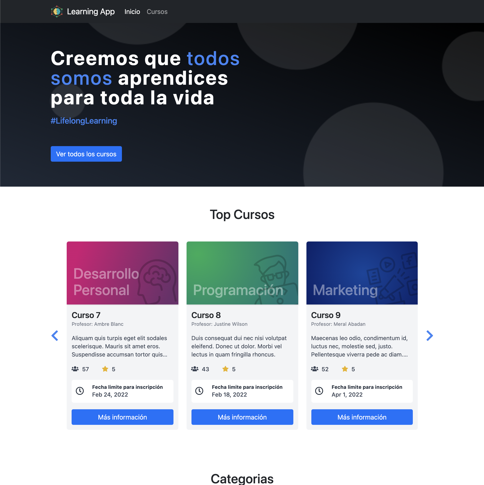

## Tecnologias utilizadas:

Para realizar este proyecto se utilizaron diferentes tecnologías, frameworks y librerías. Dentro de las cuales podemos destacar:

- [Angular](https://angular.io/) (verión 13.1)
- [Swiper](https://swiperjs.com/) (version 7.4.1)
- [Bootstrap](https://getbootstrap.com/) (version 5.1.3)

A continuación se dará una breve explicación de el uso de estas librerias/frameworks

### Angular

Es el framework utilizado para realizar las vistas y manejar los estados de la aplicación. Es la base de la aplicación y se usa desde el renderizado hasta para el ruteo de las paginas.

### Swiper

Esta librería se utilizo para poder realizar el slider de los top de cursos. Nos permite realizar slider y tiene una gran cantidad de propiedades para customizar.

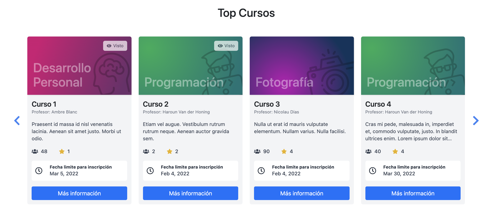

### Bootstrap

Este framework se usó para darle los estilos a diferente partes de la aplicación, además de ayudar con el responsive design. Cabe destacar que también se usaron estilos propios con Sass.

## Instruciónes

Para poder acceder a la aplicación puede hacer click en el siguiente link:

La aplicación cuenta con 3 partes fundamentales.

- Pagina de home
- Listado de cursos
- Detalles de los cursos

### Pagina de home.

En esta pagina podrás encontrar un resumen con los mejores cursos y un listado de las categorías que tiene la plataforma para una rápido acceso.

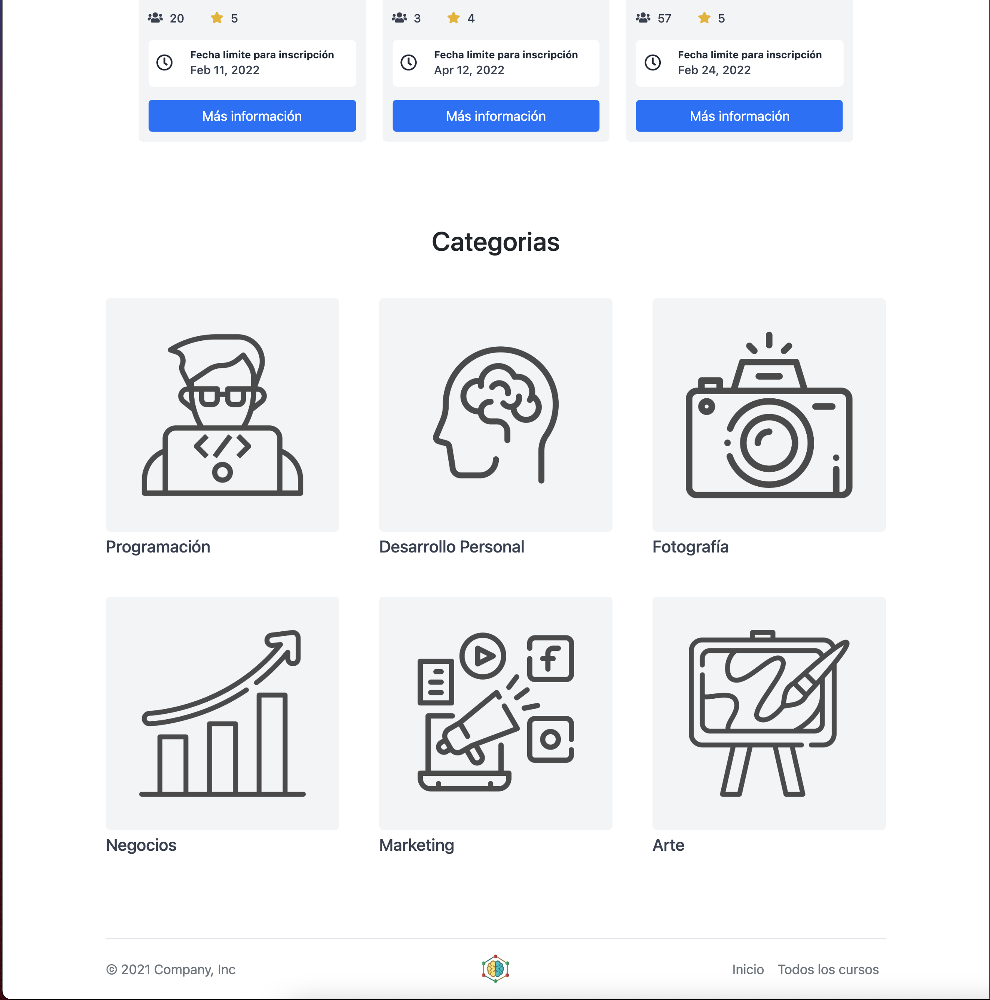
 
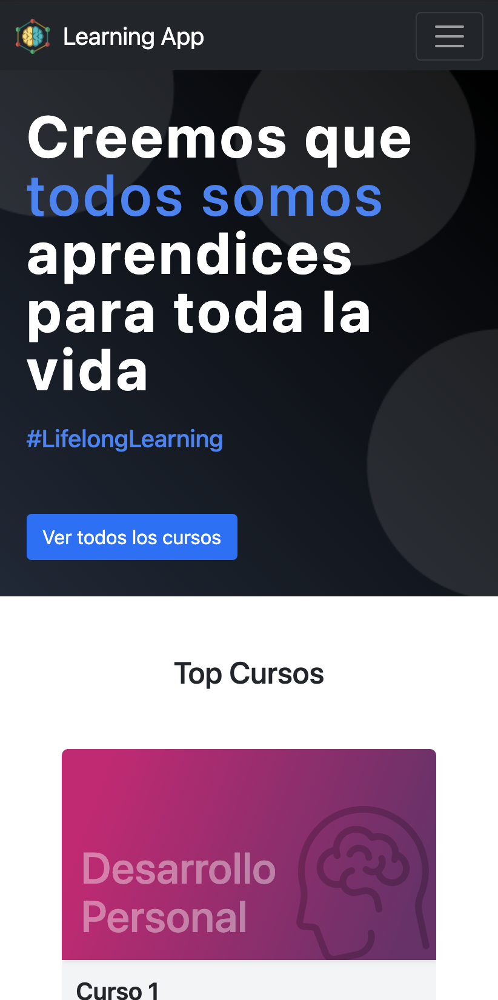
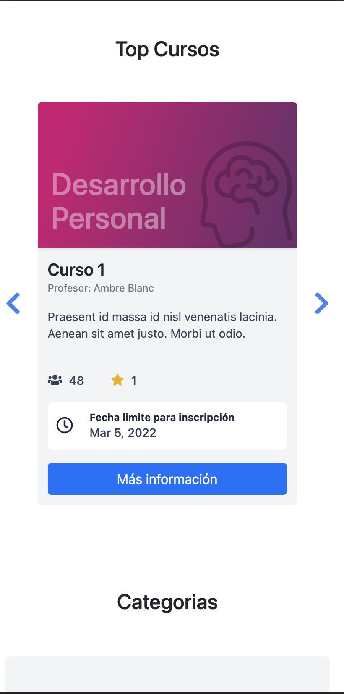

### Listado de cursos

En esta sección podemos ver todos los cursos que tiene la plataforma y nos permite filtrar por categoría e ir cambiando de pagina de una forma muy simple.

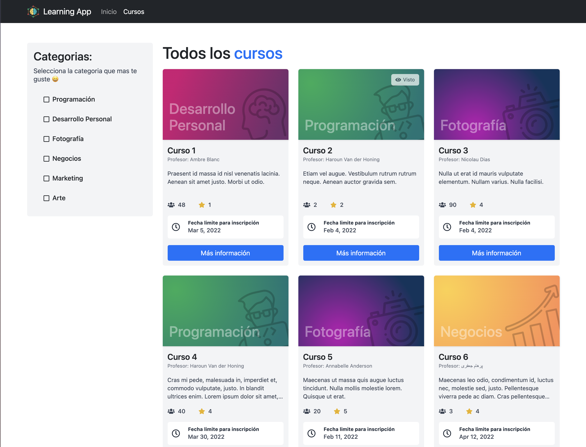
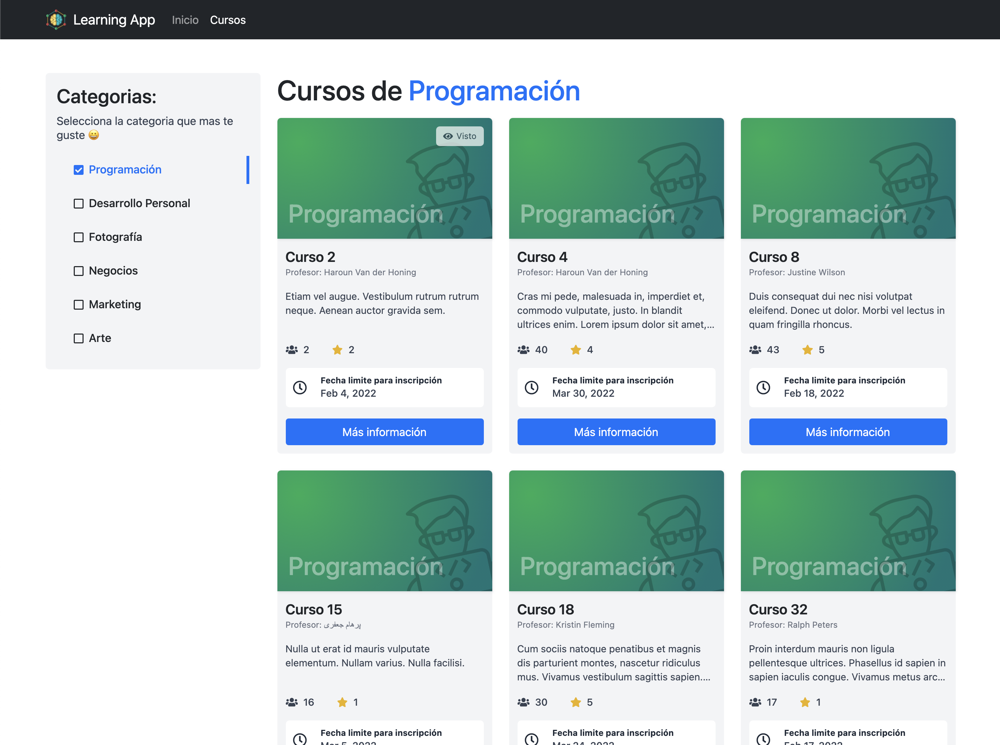
 
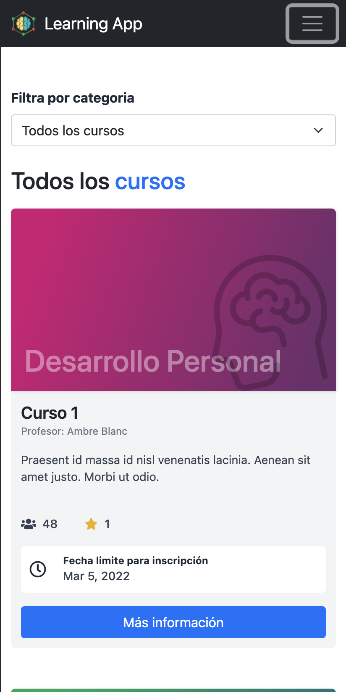
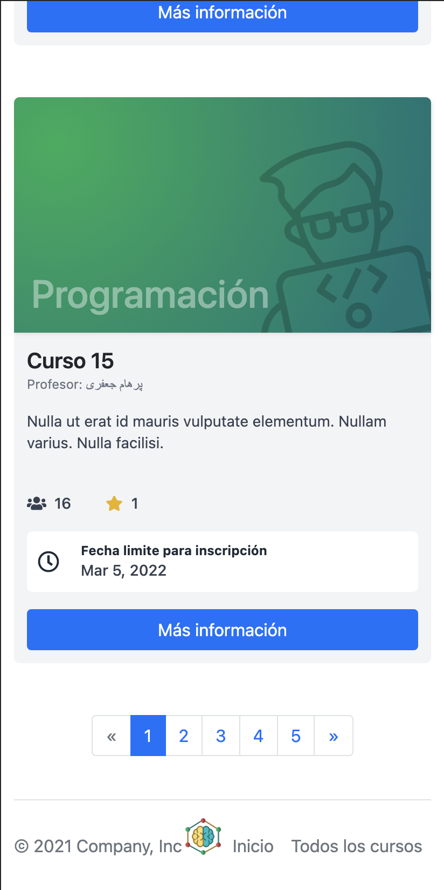

### Detalles del curso

Esta pagina nos permite ver todos los detalles que tiene un curso. Desde el tiempo total, los módulos, las clases hasta información del profesor que dicta el curso. Al entra a esta pagina el curso se marca como visto y podrás ver un indicador en la sección de cursos. Esto te permite tener claro que cursos has visto y cuales te faltan por revisar.
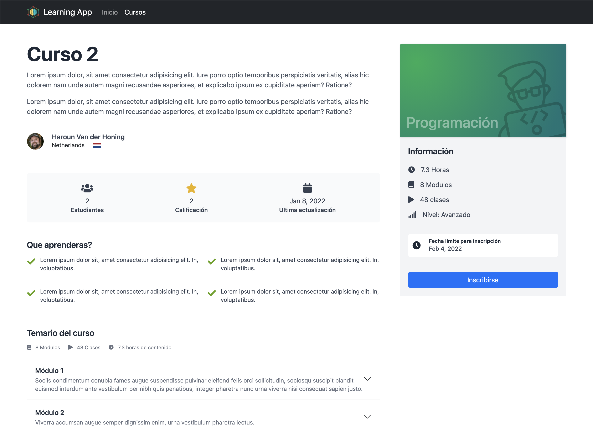
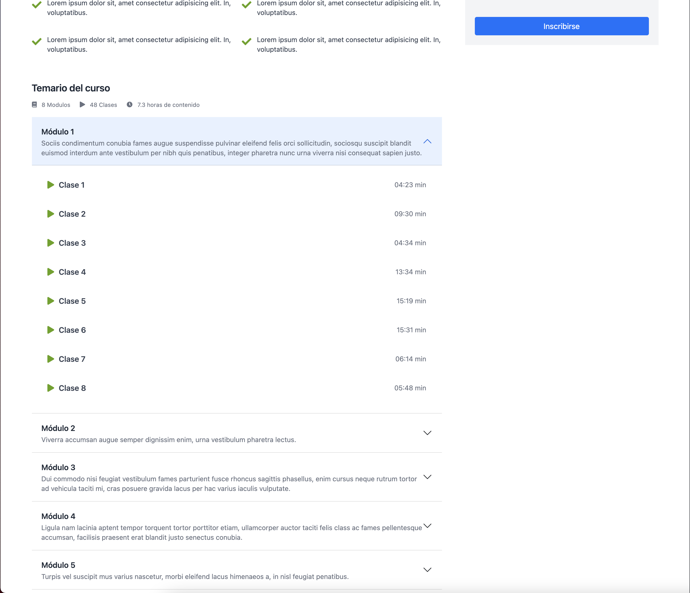
 
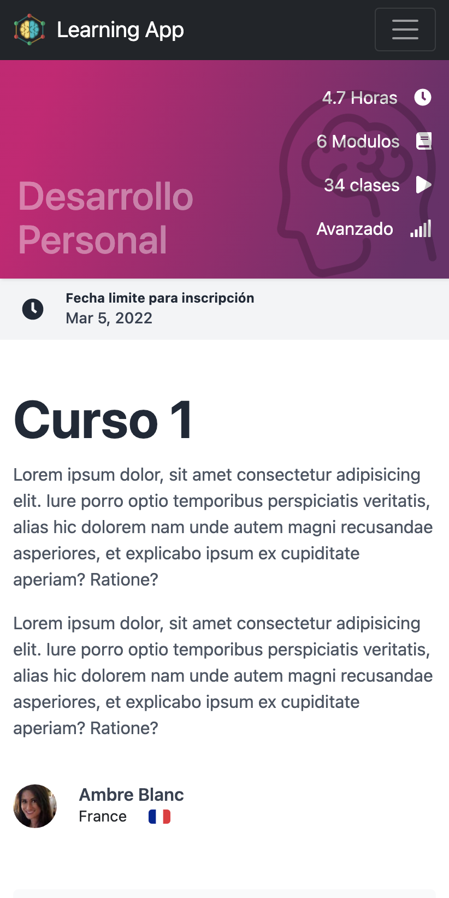
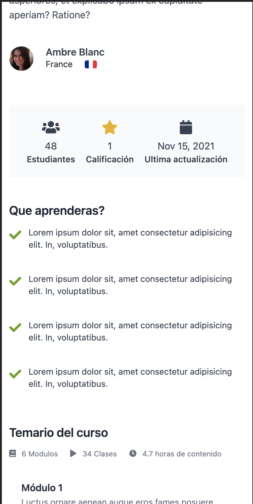

## Extras

El backend utilizado en el proyecto fue creado especialmente para este caso. Se realizo con NodeJs y Express. Esta Hosteado en Heroku y nos da información de hasta 300 cursos ficticios.

Para más información puedes visitar el [repositorio del backend](https://github.com/fabian0896/mock-data-server)
